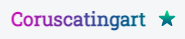

<!-- Improved compatibility of back to top link: See: https://github.com/othneildrew/Best-README-Template/pull/73 -->

<a name="readme-top"></a>

<!--
*** Thanks for checking out the Best-README-Template. If you have a suggestion
*** that would make this better, please fork the repo and create a pull request
*** or simply open an issue with the tag "enhancement".
*** Don't forget to give the project a star!
*** Thanks again! Now go create something AMAZING! :D
-->

<!-- PROJECT SHIELDS -->
<!--
*** I'm using markdown "reference style" links for readability.
*** Reference links are enclosed in brackets [ ] instead of parentheses ( ).
*** See the bottom of this document for the declaration of the reference variables
*** for contributors-url, forks-url, etc. This is an optional, concise syntax you may use.
*** https://www.markdownguide.org/basic-syntax/#reference-style-links
-->

[![Contributors][contributors-shield]][contributors-url]
[![Forks][forks-shield]][forks-url]
[![Stargazers][stars-shield]][stars-url]
[![Issues][issues-shield]][issues-url]
[![MIT License][license-shield]][license-url]
[![LinkedIn][linkedin-shield]][linkedin-url]

<!-- PROJECT LOGO -->
<br />
<div align="center">
  <a href="https://github.com/shafe03/rafee-alam-portfolio">
    
  </a>

<h3 align="center">Portfolio Website</h3>

  <p align="center">
    This is the repository of Rafee Alam portfolio website #coruscatingart.
    <br />
    <a href="https://github.com/github_username/repo_name"><strong>Explore the docs »</strong></a>
    <br />
    <br />
    <a href="https://www.rafeealam.netlify.app">View Demo</a>
    ·
    <a href="https://github.com/techtinkererfullstack/rafee-alam-portfolio/issues">Report Bug</a>
    ·
    <a href="https://github.com/techtinkererfullstack/rafee-alam-portfolio/issues">Request Feature</a>
  </p>
</div>

<!-- TABLE OF CONTENTS -->
<details>
  <summary>Table of Contents</summary>
  <ol>
    <li>
      <a href="#about-the-project">About The Project</a>
      <ul>
        <li><a href="#built-with">Built With</a></li>
      </ul>
    </li>
    <li>
      <a href="#getting-started">Getting Started</a>
      <ul>
        <li><a href="#prerequisites">Prerequisites</a></li>
        <li><a href="#installation">Installation</a></li>
      </ul>
    </li>
    <li><a href="#usage">Usage</a></li>
    <li><a href="#roadmap">Roadmap</a></li>
    <li><a href="#contributing">Contributing</a></li>
    <li><a href="#license">License</a></li>
    <li><a href="#contact">Contact</a></li>
    <li><a href="#acknowledgments">Acknowledgments</a></li>
  </ol>
</details>

<!-- ABOUT THE PROJECT -->

## About The Project

[![Rafee Alam Portfolio][product-screenshot]](https://rafeealam.netlify.app)

This project is for my brother. Challange is to develop his design into website. project was challanging. 😊✨
In this project i have focused on Front-End technology. Key learning from this project is to use SASS and Vite Bundler.

- github_username: techtinkererfullstack
- repo_name: https://github.com/techtinkererfullstack/
- linkedin_username: techtinkererfullstack
- linkedin_URL: https://www.linkedin.com/in/techtinkererfullstack/
- email: md.shafealam03@gmail.com
- project_title: Portfolio Website of Rafee Alam
- project_description: Build a personal portfolio website.

<p align="right">(<a href="#readme-top">back to top</a>)</p>

### Built With

- [![HTML5][html5]][html5-url]
- [![CSS][css]][css-url]
- [![SCSS][scss]][scss-url]
- [![JavaScript][javascript]][javascript-url]
- [![Vite][vite]][vite-url]
- [![npm][npm]][vite-url]

<!-- * [![Next][Next.js]][Next-url]
* [![React][React.js]][React-url]
* [![Vue][Vue.js]][Vue-url]
* [![Angular][Angular.io]][Angular-url]
* [![Svelte][Svelte.dev]][Svelte-url]
* [![Laravel][Laravel.com]][Laravel-url]
* [![Bootstrap][Bootstrap.com]][Bootstrap-url]
* [![JQuery][JQuery.com]][JQuery-url] -->

<p align="right">(<a href="#readme-top">back to top</a>)</p>

<!-- GETTING STARTED -->

## Getting Started

To build your own portfolio website like this clone <a href="https://github.com/techtinkererfullstack/rafee-alam-portfolio.git" target="_blank">this</a> repository.

### Prerequisites

To start this project you need a code editor, I like to use VScode. Nodejs must be installed. You must know HTML, CSS, SCSS, Javasctipt and any bundler. In this project I am using latest bundler VITE. To install Vite:

- Install Vite
  ```sh
  npm install vite
  ```

### Installation

1. Clone the repo
   ```sh
   https://github.com/techtinkererfullstack/rafee-alam-portfolio.git
   ```
2. Install NPM packages
   ```sh
   npm install
   ```
3. In package.json file these script should be added after installing vite
   ```js
   {
   "scripts": {
    "dev": "vite", // start dev server, aliases: `vite dev`, `vite serve`
    "build": "vite build", // build for production
    "preview": "vite preview" // locally preview production build
   }
   }
   ```
4. Run development server
   ```sh
   npm run dev
   ```
5. build command
   ```sh
   npm run build
   ```

<p align="right">(<a href="#readme-top">back to top</a>)</p>

<!-- USAGE EXAMPLES -->

## Usage

<!-- Use this space to show useful examples of how a project can be used. Additional screenshots, code examples and demos work well in this space. You may also link to more resources.

_For more examples, please refer to the [Documentation](https://example.com)_ -->

Only one request to you give credit to Desinger who made this design. We will really appreciate it. 🙂

- Designed By: <a href="https://www.rafeealam.netlify.app" target="_blank">Rafee Alam</a>
  -- Facebook: <a href="https://www.facebook.com/coruscatingart/" target="_blank">https://www.facebook.com/coruscatingart/</a>
  -- Linked In: <a href="https://www.linkedin.com/in/coruscatingart/" target="_blank">https://www.linkedin.com/in/coruscatingart/</a>
  -- Behance: <a href="https://www.behance.net/coruscatingart" target="_blank">https://www.behance.net/coruscatingart</a>
  -- Dribbble: <a href="https://dribbble.com/coruscatingart" target="_blank">https://dribbble.com/coruscatingart</a>
  -- Website: <a href="https://www.rafeealam.netlify.app" target="_blank">https://www.rafeealam.netlify.app</a>

- Developed By: <a href="https://shafealam.wordpress.com/" target="_blank">https://shafealam.wordpress.com/</a>
  -- Facebook: <a href="https://www.facebook.com/techtinkererfullstack/" target="_blank">https://www.facebook.com/techtinkererfullstack/</a>
  -- Linked In: <a href="https://www.linkedin.com/in/techtinkererfullstack/" target="_blank">https://www.linkedin.com/in/techtinkererfullstack/</a>

<p align="right">(<a href="#readme-top">back to top</a>)</p>

<!-- ROADMAP -->

<!-- ## Roadmap

- [ ] Feature 1
- [ ] Feature 2
- [ ] Feature 3
  - [ ] Nested Feature

See the [open issues](https://github.com/techtinkererfullstack/rafee-alam-portfolio/issues) for a full list of proposed features (and known issues).

<p align="right">(<a href="#readme-top">back to top</a>)</p> -->

<!-- CONTRIBUTING -->

## Contributing

Contributions are what make the open source community such an amazing place to learn, inspire, and create. Any contributions you make are **greatly appreciated**.

If you have a suggestion that would make this better, please fork the repo and create a pull request. You can also simply open an issue with the tag "enhancement".
Don't forget to give the project a star! Thanks again!

1. Fork the Project
2. Create your Feature Branch (`git checkout -b feature/AmazingFeature`)
3. Commit your Changes (`git commit -m 'Add some AmazingFeature'`)
4. Push to the Branch (`git push origin feature/AmazingFeature`)
5. Open a Pull Request

<p align="right">(<a href="#readme-top">back to top</a>)</p>

<!-- LICENSE -->

## License

Distributed under the MIT License. See `LICENSE.txt` for more information.

<p align="right">(<a href="#readme-top">back to top</a>)</p>

<!-- CONTACT -->

## Contact

Shafe Alam - [Linked_In](https://www.linkedin.com/in/techtinkererfullstack/)
Project Link: [https://github.com/techtinkererfullstack/](https://github.com/techtinkererfullstack/)

<p align="right">(<a href="#readme-top">back to top</a>)</p>

<!-- ACKNOWLEDGMENTS -->

<!-- ## Acknowledgments

- []()
- []()
- []()

<p align="right">(<a href="#readme-top">back to top</a>)</p> -->

<!-- MARKDOWN LINKS & IMAGES -->
<!-- https://www.markdownguide.org/basic-syntax/#reference-style-links -->

[contributors-shield]: https://img.shields.io/github/contributors/github_username/repo_name.svg?style=for-the-badge
[forks-shield]: https://img.shields.io/github/forks/github_username/repo_name.svg?style=for-the-badge
[stars-shield]: https://img.shields.io/github/stars/github_username/repo_name.svg?style=for-the-badge
[issues-shield]: https://img.shields.io/github/issues/github_username/repo_name.svg?style=for-the-badge
[license-shield]: https://img.shields.io/github/license/github_username/repo_name.svg?style=for-the-badge
[linkedin-shield]: https://img.shields.io/badge/-LinkedIn-black.svg?style=for-the-badge&logo=linkedin&colorB=555

<!-- --------------------------------------------------------------------------------------------------------- -->

[contributors-url]: https://github.com/techtinkererfullstack/rafee-alam-portfolio/graphs/contributors
[forks-url]: https://github.com/techtinkererfullstack/rafee-alam-portfolio/forks
[stars-url]: https://github.com/github_username/repo_name/stargazers
[issues-url]: https://github.com/techtinkererfullstack/rafee-alam-portfolio/issues
[license-url]: https://github.com/techtinkererfullstack/rafee-alam-portfolio/blob/main/LIcense
[linkedin-url]: https://www.linkedin.com/in/techtinkererfullstack/

<!-- --------------------------------------------------------------------------------------------------- -->

[html5]: https://img.shields.io/badge/html5-000000?style=for-the-badge&logo=html5&logoColor=white
[css]: https://img.shields.io/badge/CSS-GREEN?style=for-the-badge&logo=CSS&logoColor=green
[scss]: https://img.shields.io/badge/SCSS-pink?style=for-the-badge&logo=CSS&logoColor=pink
[javascript]: https://img.shields.io/badge/JavaScrip-yellow?style=for-the-badge&logo=html5&logoColor=yellow
[vite]: https://img.shields.io/badge/vite-blue?style=for-the-badge&logo=html5&logoColor=blue
[npm]: https://img.shields.io/badge/NPM-red?style=for-the-badge&logo=html5&logoColor=red

<!-- ---------------------------------------------------------------- -->

[html5-url]: ""
[css-url]: ""
[scss-url]: ""
[javascript-url]: ""
[vite-url]: ""
[npm-url]: ""

<!-- ------------------------------------------------------------------------ -->

[product-screenshot]: https://github.com/shafe03/rafee-alam-portfolio/blob/main/Image/portfolio-mockup-rafee-alam.jpg

<!-- [next.js]: https://img.shields.io/badge/next.js-000000?style=for-the-badge&logo=nextdotjs&logoColor=white
[next-url]: https://nextjs.org/
[react.js]: https://img.shields.io/badge/React-20232A?style=for-the-badge&logo=react&logoColor=61DAFB
[react-url]: https://reactjs.org/
[vue.js]: https://img.shields.io/badge/Vue.js-35495E?style=for-the-badge&logo=vuedotjs&logoColor=4FC08D
[vue-url]: https://vuejs.org/
[angular.io]: https://img.shields.io/badge/Angular-DD0031?style=for-the-badge&logo=angular&logoColor=white
[angular-url]: https://angular.io/
[svelte.dev]: https://img.shields.io/badge/Svelte-4A4A55?style=for-the-badge&logo=svelte&logoColor=FF3E00
[svelte-url]: https://svelte.dev/
[laravel.com]: https://img.shields.io/badge/Laravel-FF2D20?style=for-the-badge&logo=laravel&logoColor=white
[laravel-url]: https://laravel.com
[bootstrap.com]: https://img.shields.io/badge/Bootstrap-563D7C?style=for-the-badge&logo=bootstrap&logoColor=white
[bootstrap-url]: https://getbootstrap.com
[jquery.com]: https://img.shields.io/badge/jQuery-0769AD?style=for-the-badge&logo=jquery&logoColor=white
[jquery-url]: https://jquery.com -->
